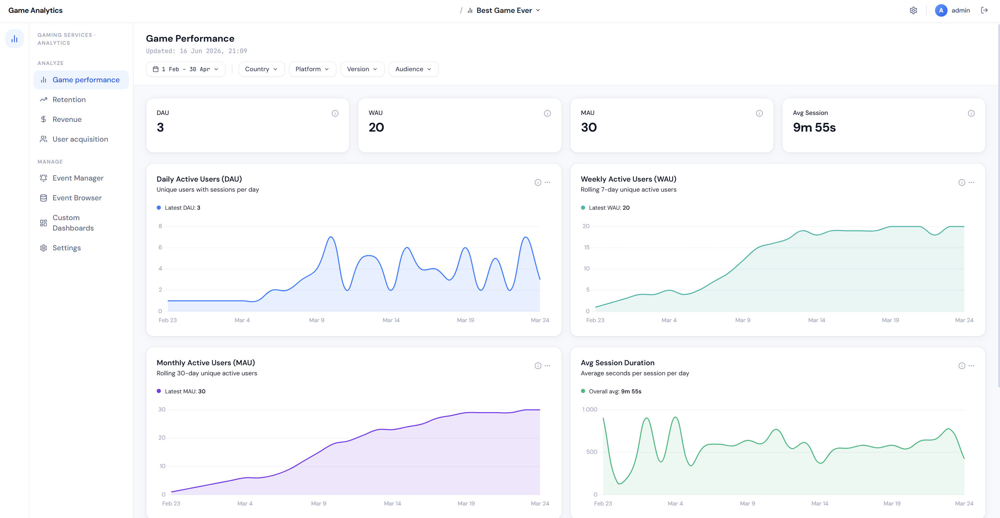
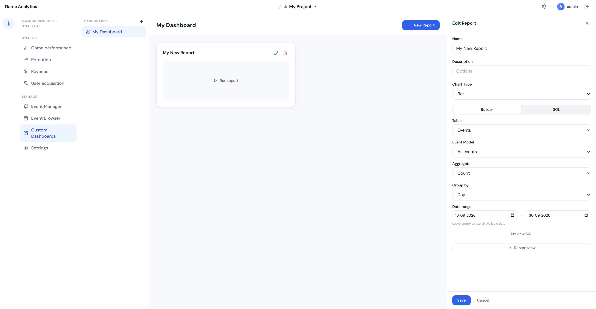
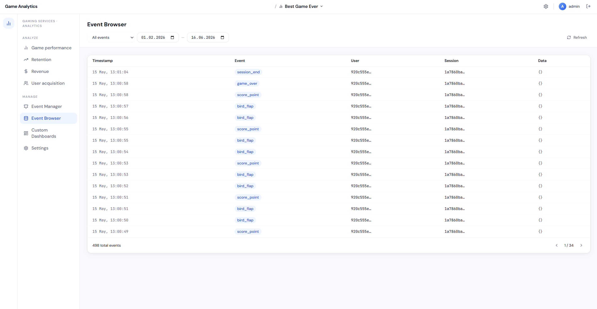

# Game Analytics

Локальный (on-premise) сервис игровой аналитики для игровых студий — self-hosted альтернатива облачным платформам вроде Unity Analytics. Собирайте игровые события, изучайте их на дашборде и стройте кастомные отчёты на своей собственной инфраструктуре.

## Возможности

- **Приём событий** с валидацией JSON по настраиваемым моделям событий (permissive-подход — неизвестные события сохраняются, а не отклоняются)
- **Unity C# SDK** с управлением жизненным циклом сессии, автоматическим батчингом событий и обогащением данными об устройстве
- **Визуальный конструктор отчётов** для группировки и выборки событий по дню, неделе, месяцу, стране, платформе, названию события или произвольным параметрам
- **Дашборд метрик**: выручка, ARPU, ARPPU, число платящих пользователей, конверсия
- **Поддержка нескольких проектов** для студий с несколькими играми


*Обзорный дашборд с выручкой и метриками активных пользователей*
 

*Визуальный конструктор отчётов с параметрами группировки*
 

*Просмотр входящих событий*

## Стек технологий

| Слой              | Технология |
|-------------------|------------|
| Backend           | ASP.NET 8, Entity Framework Core |
| База данных       | PostgreSQL (JSONB для данных событий) |
| Frontend          | Vue 3, Tailwind CSS, Chart.js |
| SDK               | Unity (C#) |
| Инфраструктура    | Docker Compose, Nginx |

## Начало работы

### Требования

- Docker и Docker Compose
- Сервер (или локальная машина) для хостинга — внешние облачные сервисы не требуются

### Запуск через Docker

```bash
docker compose -p user_analytics up -d --build
```

Эта команда собирает и запускает весь стек — backend API, PostgreSQL и Vue-дашборд за Nginx — на одном открытом порту, при этом запросы `/api/*` проксируются на backend.

При первом запуске дашборд проведёт вас через первичную настройку (создание админ-аккаунта и первого проекта).

### Остановка стека

```bash
docker compose -p user_analytics down
```

## Unity SDK

Добавьте SDK в свой Unity-проект и инициализируйте его с API-ключом вашего проекта. SDK берёт на себя:

- Старт и подтверждение сессии на backend перед отправкой событий
- Автоматический батчинг (каждые 20 событий)
- Обогащение данными об устройстве
- Сериализацию без внешних зависимостей, устойчивую к offline-режиму

Подробности интеграции см. в [документации SDK].

## Аутентификация

- Дашборд: JWT Bearer токены (срок действия 8 часов)
- Эндпоинты приёма событий SDK: заголовок `X-Api-Key`, привязан к проекту

## Структура проекта

```
.
├── backend/          # ASP.NET 8 API, EF Core, доступ к PostgreSQL
├── game-analytics/   # Unity SDK и демо-интеграция
└── docker-compose.yml
```

## Лицензия

[Добавить лицензию]
